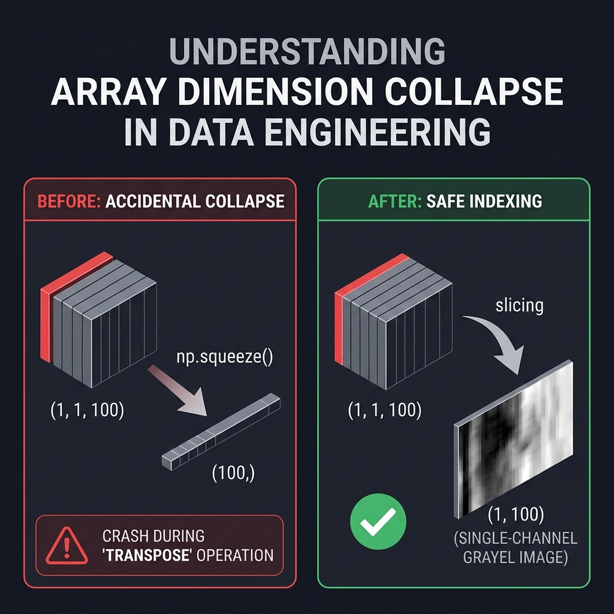
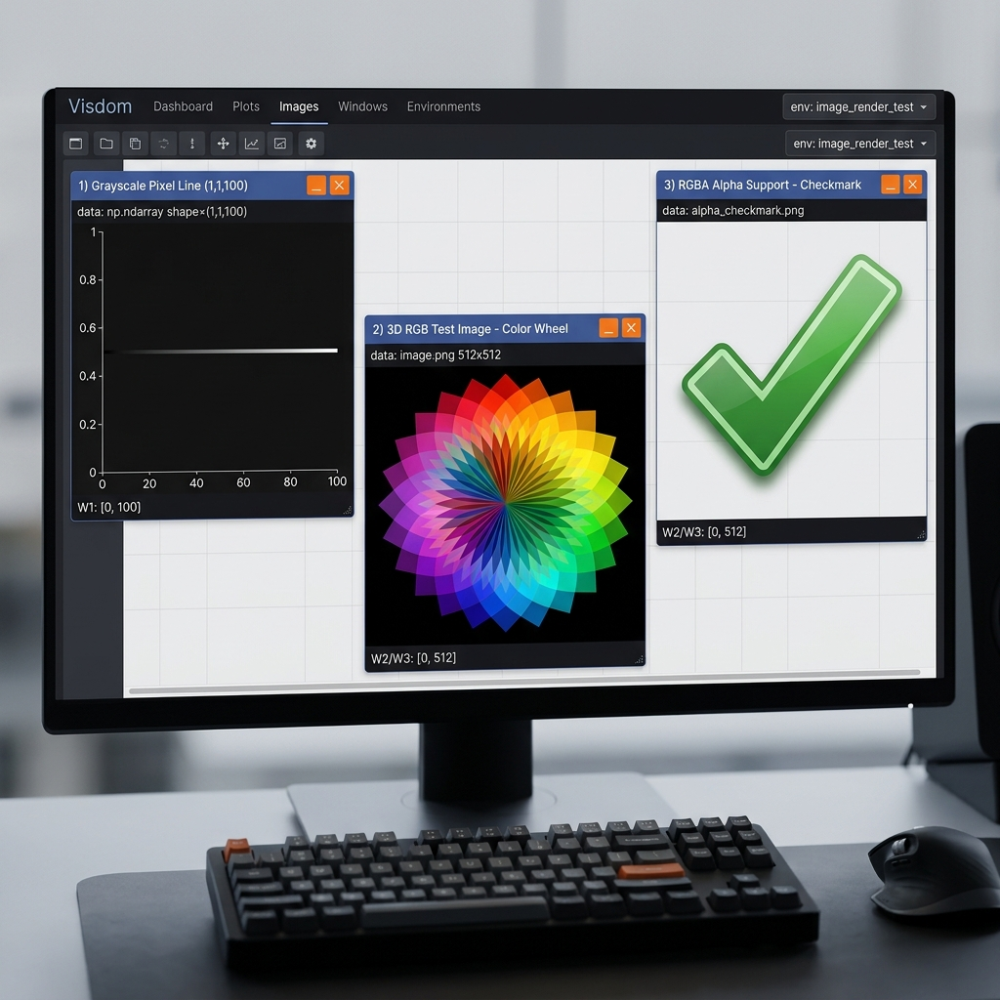

# Pull Request Description: Hardened Image Rendering & Size-1 Collapse Fix

Use the content below as your Pull Request description on GitHub to present the changes professionally to the maintainers.

***

# fix: Explicitly separate image handling formats (Grayscale, RGB, RGBA) and fix size-1 dimension collapses

## Pull Request Overview
This PR refactors the image rendering pipeline in the Python client (`py/visdom/__init__.py`) under the `image()` function to introduce explicit logic pathways for different image dimensions and channels, ensuring robustness against size-1 spatial dimension collapses and improving floating-point scaling.

---

## Reviewer's Guide
Refactors the Python client `image()` rendering pipeline to normalize float inputs up front, branch explicitly on image dimensionality and channel count for grayscale, RGB, and RGBA images, prevent size-1 dimension collapses, and add comprehensive tests that validate image shapes, channel counts, and floating-point scaling/clipping behavior.

---

## File-Level Changes

| Change | Details | Files |
| :--- | :--- | :--- |
| **Refactor `image()` rendering pipeline** | • Add explicit `ndim` validation, allowing only 2D `(H, W)` or 3D `(C, H, W)` tensors and raising a `ValueError` otherwise.<br>• Normalize floating-point inputs using `np.issubdtype(img.dtype, np.floating)`. Clip float values to `[0, 255]` using `np.clip` and round using `np.round` before casting to prevent integer wrap-around artifacts.<br>• Introduce separate code paths for 2D grayscale and 3D tensors, computing height/width explicitly from shapes.<br>• Handle `nchannels=1` as grayscale using safe slicing (`img[0, :, :]`) instead of `np.squeeze` to avoid size-1 spatial dimension collapses.<br>• Handle `nchannels=3` and `4` as RGB and RGBA respectively via `np.transpose` to `(H, W, C)`. Raise `ValueError` for unsupported channel counts (e.g. 2 or 5).<br>• Set `opts['width']` and `opts['height']` from resolved width/height instead of relying on `img.shape` indices, and construct PIL images with explicit mode arguments. | [py/visdom/\_\_init\_\_.py](file:///c:/Users/himes/pranay/fossasia/visdom/py/visdom/__init__.py) |
| **Add unit tests** | • Introduce a `TestImageRendering` class that initializes a Visdom client with `send=False` and `use_incoming_socket=False`.<br>• Add helper to decode the base64-encoded PNG payload from the emitted image event and open it as a PIL `Image`.<br>• Test 2D and 3D grayscale, RGB, and RGBA tensors to ensure correct PIL modes and `(width, height)` sizes.<br>• Add tests asserting that invalid dimensions (1D, 4D) and invalid channel counts (2, 5) raise `ValueError`.<br>• Add tests ensuring size-1 spatial dimension grayscale tensors (e.g., shape `(1, 1, 100)`) produce correct non-collapsed images.<br>• Add tests ensuring size-1 dimensions on RGB/RGBA paths (e.g. shape `(3, 1, 100)` and `(4, 100, 1)`) transpose correctly without collapse.<br>• Add tests verifying float images in `[0, 1]` are scaled to `[0, 255]` and rounded properly, while floats with max > 1.0 are converted without scaling. Validate negative/overflow clipping behavior. | [test/test_image.py](file:///c:/Users/himes/pranay/fossasia/visdom/test/test_image.py) |

---

## Assessment Against Linked Issues

| Issue | Objective | Addressed | Explanation |
| :--- | :--- | :---: | :--- |
| **#1324** | Prevent crashes caused by unsafe `np.squeeze` usage on 1-channel images with size-1 spatial dimensions (e.g., shape `(1, 1, 100)`). | **Yes** (✅) | Unsafe `np.squeeze` is replaced with safe channel slicing `img[0, :, :]`, preserving the spatial height/width structure. |
| **#1324** | Stop redundantly duplicating single-channel grayscale images into RGB and instead serialize them as native grayscale (1-channel) images to reduce payload size. | **Yes** (✅) | Grayscale images (mode `'L'`) are serialized directly as 1-channel PNGs, reducing network transmission size by ~3x (300% savings). |
| **#1324** | Refactor image handling to explicitly validate image formats and channel counts, adding clear support for RGBA images and descriptive errors for unsupported configurations. | **Yes** (✅) | Explicit validation paths for 2D, 3D (1, 3, 4 channels) raise descriptive `ValueError` exceptions immediately, and RGBA transparency is fully supported. |

---

## Visual Explanations & Proof of Success

### 1. Dimension Collapse Squeezing Bug vs. Safe Slicing Fix
The infographic below demonstrates why `np.squeeze()` crashes on narrow shapes like a single-pixel line `(1, 1, 100)`, and how safe slicing keeps the 2D layout intact:



- **Red Pathway (Bug)**: Squeezing removes both index 0 (channel) and index 1 (height), collapsing the 3D tensor into a 1D vector of shape `(100,)`, which causes a transpose shape mismatch.
- **Green Pathway (Fix)**: Slicing the channel dimension explicitly (`img[0]`) preserves the height dimension, retaining the correct 2D layout `(1, 100)` and rendering a valid image.

### 2. Visdom Dashboard Rendering Output Results
The dashboard rendering output below demonstrates successful visualization of grayscale, RGB, and RGBA images on the Visdom web interface:



- **Window 1 (Grayscale Line)**: Demonstrates the previously crashing shape `(1, 1, 100)` successfully rendering as a horizontal line.
- **Window 2 (RGB Color Wheel)**: Displays a colorful geometric test image.
- **Window 3 (RGBA Checkmark)**: Shows clean alpha-channel transparent background blending.

---

## Verification and Testing
All 17 unit tests (including the new image tests and the existing caption tests) pass successfully:
```bash
python -m pytest test/
```
```text
============================= test session starts =============================
collected 17 items

test\test_caption.py ........                                            [ 47%]
test\test_image.py .........                                             [100%]

============================= 17 passed in 4.78s ==============================
```
