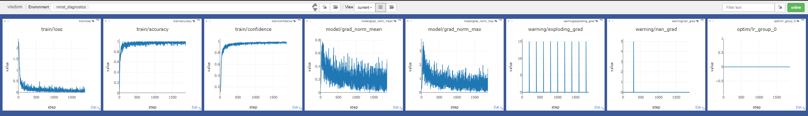
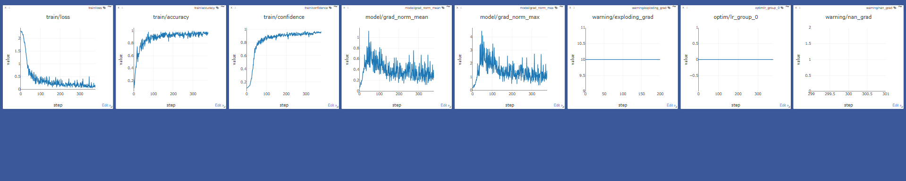

# Visdom Diagnostics Logger

A PyTorch-native Visdom logger for real-time training observability, gradient health monitoring, and model diagnostics.

It is designed to make training easier to debug by surfacing the signals that matter most: loss curves, accuracy, confidence, learning rate, gradient anomalies, and optional model-health visualizations.

---

## What this project does

This logger turns your training loop into a live dashboard. It can track standard training metrics, discover metrics from model outputs, detect problematic gradients, and show optional model-health summaries such as heatmaps and histograms.

The project is built to stay lightweight by default while still supporting deeper diagnostics when you need them.

---

## Highlights

### Visible in the demo dashboard
- Training loss
- Training accuracy
- Training confidence
- Gradient norm mean
- Gradient norm max
- Exploding gradient warnings
- NaN gradient warnings
- Optimizer learning rate tracking

### Built into the logger, even if not always shown in the demo
- Batched scalar logging to reduce dashboard noise
- Automatic metric discovery from model outputs and targets
- Custom metric registration
- Safe attach/detach lifecycle for PyTorch models
- Optional parameter statistics tracking
- Optional model-health heatmaps
- Optional weight histograms
- Periodic heavier diagnostics to keep training responsive

---

## Visuals

> Place the media files inside an `assests/` folder next to this README.

### 1) Dashboard with NaN and exploding-gradient warnings

### 2) Clean dashboard without NaN warning spikes

### 3) Demo video
[Watch the demo video](https://github.com/user-attachments/assets/fed2d8e4-3287-40a9-a0ba-d7b28de7208b)

---

## Why this logger is useful

Training can look “fine” while important signals are quietly going wrong. This logger helps expose:

- whether gradients are exploding
- whether NaNs are appearing
- whether learning rate is behaving as expected
- whether the model is actually learning or just overfitting to a misleading signal
- whether extra diagnostics should be enabled for deeper inspection

It is especially useful for debugging research prototypes, educational training loops, and model development workflows where fast feedback matters.

---

## Features in detail

### Scalar and metric logging
The logger supports scalar batching so values are buffered and flushed efficiently instead of spamming the dashboard on every call.

### Automatic logging helpers
The logger can automatically log:
- loss
- accuracy
- confidence
- discovered basic metrics from outputs and targets

### Gradient diagnostics
The logger can detect and log:
- `nan_grad`
- `exploding_grad`
- `dead_layer`

### Learning-rate tracking
The logger records optimizer learning rates per parameter group so you can inspect training dynamics over time.

### Model-health diagnostics
Optional model-health features include:
- gradient norm summaries
- parameter statistics
- heatmap visualization of model health
- weight histograms for selected layers

### Example usage

A full MNIST example is included in the repository. It shows how to:

- train a small CNN
- log loss, accuracy, and confidence
- track gradient warnings
- track learning rate
- optionally enable heavier diagnostics

**The example also demonstrates how the logger can be kept lightweight while still supporting deeper diagnostics when needed.**

### Optional diagnostics

These are available in the code and can be enabled when needed:

***enable_histograms=True***
***enable_model_health=True***
***track_parameter_stats=True***
***show_extra_model_stats=True***
***with_parameter_hooks=True***

**These options are useful when you want a more detailed view of training behavior without cluttering the default dashboard.**

### Folder Structure 

py/
└── visdom/
    └── integrations/
        ├── __init__.py
        └── pytorch/
            ├── __init__.py
            ├── diagnostics.py
            ├── hooks.py
            ├── metrics.py
            ├── logger.py
            └── examples/
                └── train_mnist_diagnostics.py

tests/
└── test_pytorch_logger.

